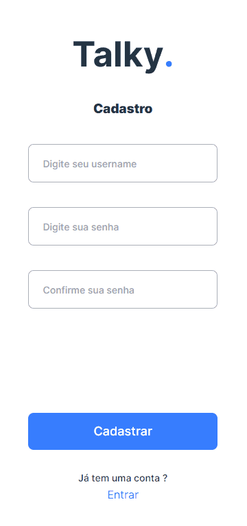
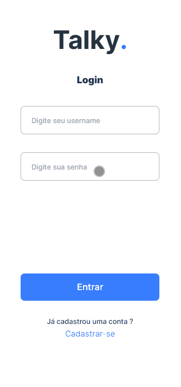
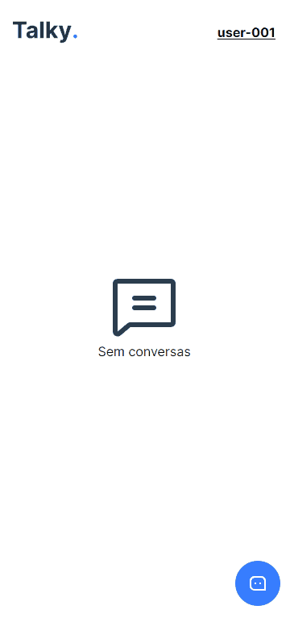
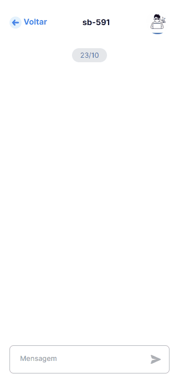
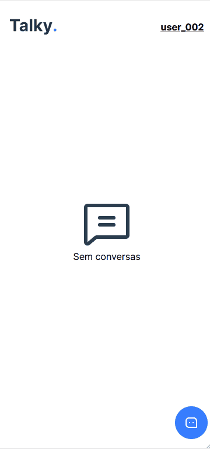

<h1>Chat</h1>

<h2>🔗 Tópicos</h2>
<ul>
<li><a href="#about">Sobre</a></li>
<li><a href="#tools">Ferramentas</a></li>
<li><a href="#db">Modelagem</a></li>
<li><a href="#project">Projeto</a></li>
<li><a href="#how_to_use">Como usar</a></li>
</ul>

<h2 id="about" style="margin-top: 30px;">📖 Sobre</h2>

Projeto de um chat em tempo real, com sistema de autenticação JWT, feito com Django no back-end e React no front-end.

<h2 id="tools" style="margin-top: 30px;">🛠️ Principais ferramentas</h2>

<h3>Django</h3>
<ul>
<li>Fast</li>
<li>Django</li>
<li>Django Channels</li>
<li>Django Rest Framework</li>
<li>Simple JWT</li>
<li>Redis</li>
</ul>

<h3>React</h3>
<ul>
<li>Vite ts</li>
<li>Tailwind</li>
<li>Styled-components</li>
<li>Phosphor-react</li>
<li>date-fns</li>
<li>react-router-dom</li>
<li>react-hook-form</li>
<li>hookform/error-message</li>
<li>zod</li>
<li>date-fns</li>
<li>axios</li>
<li>headlessui</li>
<li>react-use-websocket</li>
</ul>

<h2 id="db" style="margin-top: 30px;">🏷️ Modelagem do banco de dados</h2>

<h3>User ( AbstractUser do Django )</h3>
<ul>
<li>Username</li>
<li>Senha</li>
</ul>

<h3>Chat</h3>
<ul>
<li>created_by FK(User)</li>
<li>code CHAR</li>
<li>image CHAR</li>
<li>messages JSON</li>
<li>users M2M</li>
<li>created_at</li>
</ul>

<h2 id="project" style="margin-top: 30px;">🎥 Projeto</h2>
<ul>

<li style="margin-top: 30px;">
<h3>Cadastro de usuários</h3>
<h3><strong>/api/create-user</strong></h3>

Formulário sendo validado por <strong>zod</strong>

 
<kbd></kbd>
</li>

<li style="margin-top: 30px;">
<h3>Login</h3>
<h3><strong>/api/get-token</strong></h3>

Autenticação usando <strong>simple-JWT</strong> e <strong>useContext</strong>

 
<kbd></kbd>
</li>

<li style="margin-top: 30px;">
<h3>Criando um chat</h3>
<h3><strong>/api/create-chat</strong></h3>

Criando um chat enviando apenas o base64 da imagem, o código do chat é gerado automaticamente no backend

 
<kbd></kbd>
</li>

<li style="margin-top: 30px;">
<h3>Listagem de chat</h3>
<h3><strong>/api/chats/{username}</strong></h3>

Listagem de todos os chats que o usuário participa

 
<kbd></kbd>
</li>

<li style="margin-top: 30px;">
<h3>Entrar em um chat</h3>
<h3><strong>/api/register-user-in-chat/{code}</strong></h3>

Usando outro usuário, é feito o registro do usuário logado que fez a requisição, apenas enviando o código do chat

 
<kbd></kbd>
</li>

<li style="margin-top: 30px;">
<h3>Chat em tempo real</h3>
<h3><strong>ws://localhost:8000/chats/{code}</strong></h3>

Para acessar a sala basta apenas enviar o token

 
<kbd></kbd>
</li>

<ul>
